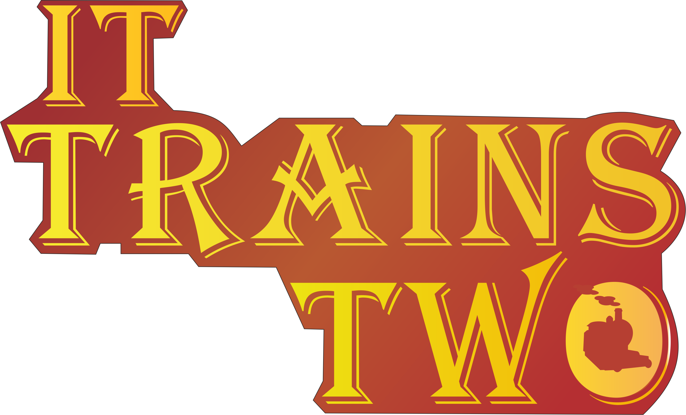
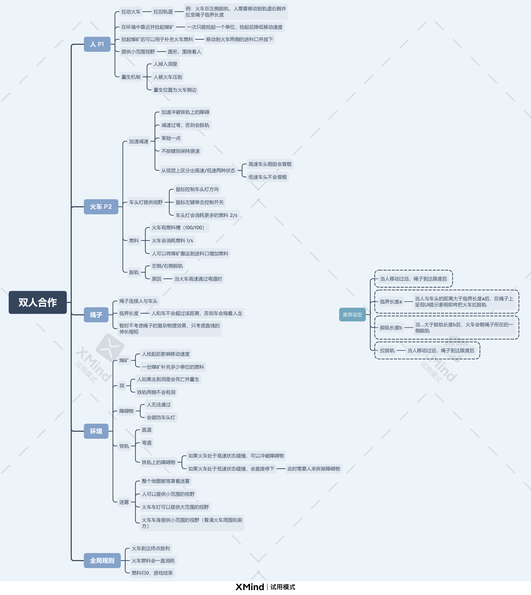
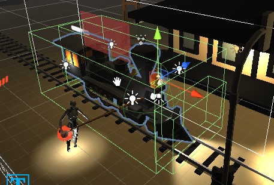
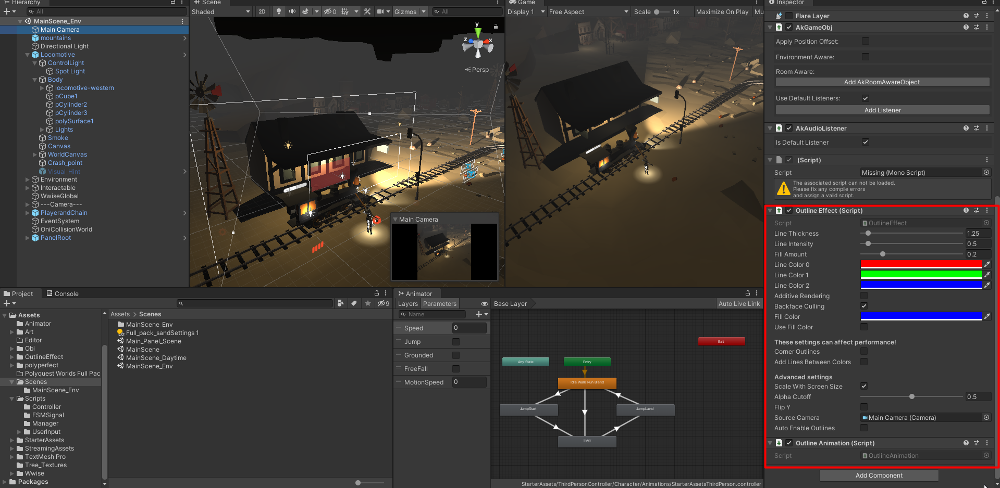
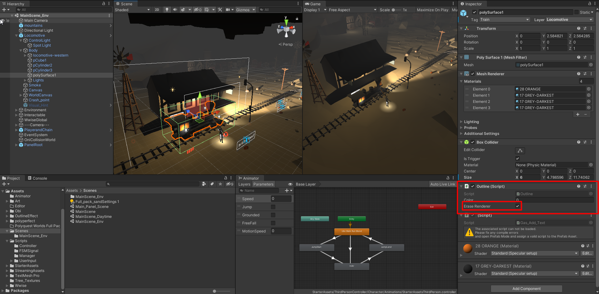

# CGJ2021

#### 游戏演示视频：[bilibili](https://www.bilibili.com/video/BV1jb4y1y7X4?from=search&seid=5906176599925647776)

## 主要玩法系统



### 1.人物角色（unity new input system）+牵连绳索（ObiRope）

人物角色使用了unity最新的input System中的范例，好处是加快了开发的速度，坏处是对现成的轮子我并不是很熟悉，通过了解ThirdPersonController.cs这个脚本大致可以了解，人物的基本前进跑跳仍然是计算更方向上的方向向量进行的，它封装在了一个Move函数中，只需要喂一个Vector3即可。

人物动画仍然是通过AnimatorController来实现的，这与我黑魂复刻中做的方式相同，由于在这个项目中动画机基本使用的较少也没有预制的模型，因此均是简单的通过animation的播放解决，同时由于这个input system人物本身使用了character controller这个组件，不同于简单的刚体这也使得obiRope的物理效果没有能实现到人物角色上。

牵连绳索使用的是ObiRope组件，在这个项目中主要只是使用了他的拉伸效果而没有能完整使用物理相关的特性，原因如上。在这里我简单定义了当绳子长度超过一定距离后，便会给人物一个相对于火车方向的一个冲量，也可以认为是当前ObiRope方向上的冲量。

```c#
//当前车相对于人的方向
Vector3 pull = new Vector3(this.transform.position.x - train.position.x,0, this.transform.position.z - train.position.z);
//向量取反，给人一个向前拉的冲量
Vector3 thrust = pull * (-1.0f);
_controller.Move(targetDirection.normalized * (_speed * Time.deltaTime) + thrust * Time.deltaTime);
```


### 2.火车（rigidbody+collider+gasManager）

火车的组成是基本刚体rigidbody与多个碰撞器collider（包含**Trigger**和**非Trigger**）以及包含车头的各类光源组成。

**火车的加减速控制**均由抽象类IUserInput完成，由按钮信号量来进行触发

**火车的前进**由rigidbody.velocity来进行

**火车的出轨**是判断当火车面向下一个track偏转角度大于45度时，速度超过阈值便会出轨

**火车的燃油消耗**由gasManager控制，由统一的Timer进行每秒燃油消耗，通过相关函数进行增减

### 3.导航系统

导航系统较为简单，主要是读取一个GameObject的list，并记录list中每一个GameObject的index值，在碰撞检测（OnTriggerEnter）或距离小于某值（Vector3.distance）时增长这个全局的index值让其指向下一个GameObject，这里的GameObject我们认为是Track（prefab）。

而为了实现火车能够移动向每一个Track点，我这里使用了两个函数，一个是缓动旋转函数，即计算当前火车与Track的角度使火车的forward值转向当前Track，再向火车施加一个向前的velocity即可。

```c#
//获取火车相对于Track的转动角度（四元数）
    Quaternion rotation = Quaternion.LookRotation(target.position - transform.position);
//转动火车的角度，从当前角度转向上方得到的角度（使用Slerp球形缓动）
    transform.rotation = Quaternion.Slerp(transform.rotation,rotation,angleSpeed*Time.deltaTime);

//在当前火车的前进方向上给一个速度
rigidbody.velocity = train.forward * current_speed;
//在与当前Track的距离小于某个阈值时将开始转动向下一个Track
if (Vector3.Distance(train.position, lines[index].position) < 10.0f)
{
  index++;
}
```


### 4.音效系统（Wwise）

音效系统主要使用的是Wwise，项目中的音效比较简单，分为触发式的音效（event），以及根据全局值进行改变的音效（RTPC）。

Events：定义一个AK.Wwise.Event，在需要触发的区域加入event.Post(camera)即可。

RTPC：定义一个AK.Wwise.RTPC，游戏中主要是不同燃油值，不同速度音效不同，因此用

RTPC.SetGlobalValue(value) 来进行音效的控制。


### 5.场景物件（prefab）

为了方便场景的搭建，所有场景中的物件**火车，人，煤矿，障碍物，导航Track**均需要搭建成prefab。


### 6.开发中的那点事儿

#### 火车车头灯的控制（鼠标射线检测）

主要逻辑是让火车车头的点光源（Spotlight）看向屏幕中鼠标指向的区域

```c#
Ray ray = Camera.main.ScreenPointToRay(Input.mousePosition);
RaycastHit hitInfo;//检测结果         
if (Physics.Raycast(ray, out hitInfo, 200))//如果碰撞到了
{
   this.transform.LookAt(new Vector3(hitInfo.point.x, 2, hitInfo.point.z));
}
```

#### 各类GameObject的互动（碰撞检测）

游戏中主要可以互动的物件为：**火车，人，煤矿，障碍物，导航Track**

任意一种可互动物件都添加了collider，根据需求他们分为**Trigger**和**非Trigger**两类。

同时根据不同的需求在每一个大的模型上也有许多collider组成



一般使用**非Trigger类型**的collider来与rigidbody（刚体）发生物理碰撞从而实现某些效果（路障停车等。。）

由**Trigger类型**的collider来实现碰撞检测，从而实现在碰撞时三种状态下的代码逻辑（OnTriggerEnter，OnTriggerStay，OnTriggerExit）

#### 模型高亮（Outline）

模型高亮使用了Outline工具，将Outline Effect及Outline Animation绑定到主相机。

在需要进行高亮的物件上绑定Outline脚本，通过eraserRender来控制是否高亮





